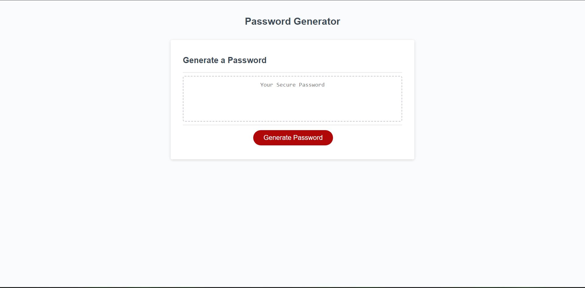
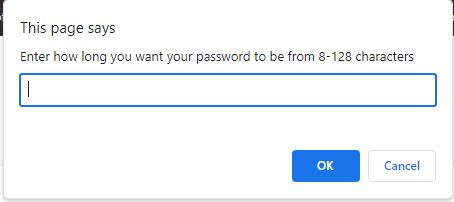
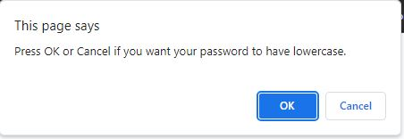
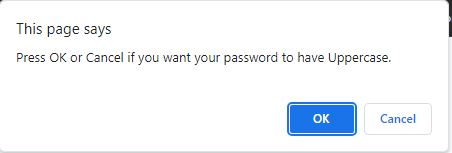
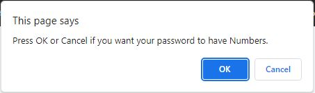
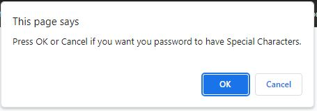
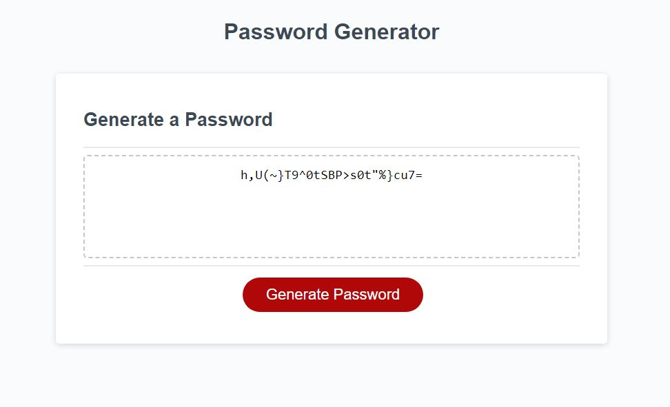

# Password-Generator

## Description
This weeks challenge was all about javascript. We had to create a password generator, that would take a users input to match the correct selected choices. Whether that was having lowercase, uppercase, numbers,and special characters. I learned that javascript can be a very powerful tool when it comes to user interaction with the webpage, and how to use the users input to create a fuctioning webpage. I ran into a problem where my password was randonmly generated, but it was in the same order as the if statements were testing if that choice was selcected and pushing that into a bigger array. Luckly during my tutoring session, Ramon pointed that out to me and I was able to overcome this edge case. Now this password generator works properly and can generate a password, anywhere from 8 characters long to 128 characters long, while also checking if the user wants lowercase, uppercase, numbers, or special characters in their password.
## Usage
This image demostrates the web application appearance and fuctionality
.
.
.
.
.
.
.

## Credits
I used the activites in the UCSD folder to help me with this project as well as the help of a tutor, that helped me understand my code wasn't what they were looking for.
## License
N/A

## Features
Can generate a random password that has the selected choices of the the users input.

## Deployed Application
https://aserrano7.github.io/Password-Generator/
